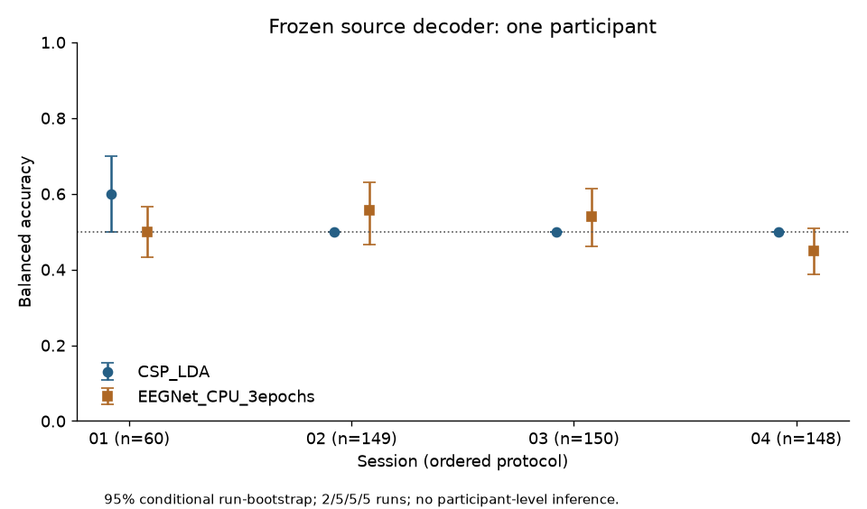
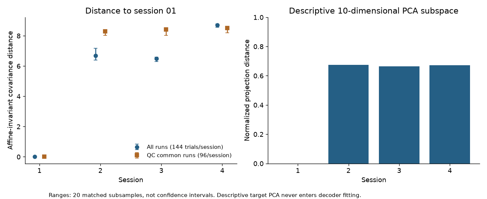

# NETBCI 第一阶段真实证据与研究决策

日期：2026-10-10（Asia/Shanghai）。本轮是单受试者可行性与探索性分析；真实结果不得冒充全队列、人体干预或 Learning-Preserving 算法验证。新来源审计、代码参数、原始结果和失败均保存于 [stage1 记录](../research_logs/netbci_stage1_20261010/)。

## 1. 数据完整性与来源范围

重新实读 NEMAR `nm000305 v1.0.0` 的已下载 169 文件（193,462,298 bytes），官方 manifest 校验全部通过；24 EDF 全信号有限，74 通道顺序跨 run 一致，250 Hz，MNE 单位 V。上游 Dataverse `10.57745/RBJRC7 v2.2` 与 NEMAR derivative 分开登记，均按已核实的数据许可使用并引用。没有追加其他受试者信号。

| 实际受试者 | Session | Run | right_hand | rest | 总 trial |
| --- | --- | --- | ---: | ---: | ---: |
| NEMAR sub-1 / 原始 sub-01 | 01 | 01–06 | 90 | 90 | 180 |
| 同上 | 02 | 01–06 | 90 | 89 | 179 |
| 同上 | 03 | 01–06 | 90 | 90 | 180 |
| 同上 | 04 | 01–06 | 90 | 88 | 178 |
| **本轮合计，仅 1 人** | 4 session | 24 run | **360** | **357** | **717** |

逐 run 数量：[run_inventory.tsv](../research_logs/netbci_stage1_20261010/run01/run_inventory.tsv)。完整 717 行事件、源文件、原始/导出 onset/sample/value/duration 与原始频率对应：[event_inventory.tsv](../research_logs/netbci_stage1_20261010/run01/event_inventory.tsv)。trial ID 中的 TSV 行是已存储事件身份，不是未公开的设计 trial 编号。24 个原始头文件 SHA 与 NEMAR upstream provenance 一致；原始 marker 和事件也已有同样 717 trial。相对设计的 768 少 51，但不能识别原始缺失 trial 的身份或排除原因，更不能补造。

24 EDF 共 **5,203 s（86.72 min）**连续信号；717 个不重叠 5 s 窗为 **3,585 s（59.75 min）**。717×74×1250 是当前读取 subset，不是整个 NETBCI。发布声明全队列 19 人/四日；本轮没有实读其他 18 人，不能给它们的信号完整性背书。

事件按真实文件核验：原始 MI=1/Rest=2，导出 right_hand=2/rest=1；onset、duration 为秒；TSV sample 从 0 起，原始 vmrk position 从 1 起。原始 ses-01/run-04 是 249.89999389648438 Hz，其余 23 run 250 Hz，derivative 全为 250 Hz。该 run 事件新 sample 对应 round(original onset×250)，最大 onset 变动 1.971 ms。原始 duration=0 是脉冲，derivative duration=5 s 是任务窗约定；上游 BIDSify 注释定义 target+feedback [0,5] s、ISI [-1,0]、结果 [5,7]，不能把 5 s 当纯 MI 或纯反馈时段。原始信号未下载/逐点比较，确切重采样滤波器仍未独立复现。

未发现已存储事件重复、顺序错配或越界；所有 717 个 TSV 与 EDF annotation 对齐。审计不等于无伪迹认证。原始小型 scans 元数据新确认 run 时间：[source_scan_timestamps.tsv](../research_logs/netbci_stage1_20261010/source_scan_timestamps.tsv)，session 日期分别为匿名化的 1916-10-29、11-01、11-05、11-07。顺序与 session 编号一致，真实年份、日期及匿名化是否保留实际间隔仍 unresolved；不将其写成真实采集日。

## 2. EEG 与真实行为映射

本轮检索原始仓储全部六个文件的元数据，并以 HTTP Range 检查 `Archive.zip`（7,449 目录项）及 `derivatives.zip`（252 项）。新请求合计 **1,123,661 bytes**，只读取目录及 sub-01 四个 scans.tsv；零信号成员、没有整包校验。原始目录：[Archive inventory](../research_logs/netbci_stage1_20261010/744565_inventory.tsv)、[derivatives inventory](../research_logs/netbci_stage1_20261010/744564_inventory.tsv)、[范围收据](../research_logs/netbci_stage1_20261010/archive_inventory_receipt.json)。derivatives 目录为 warpimg 图像等，没有可识别的行为评分文件；对未读取的信号/二进制内容不声称全面排除了任何内嵌信息。

| 记录/粒度 | 原始文件与明确字段 | 当前对应状态 | 允许用途 |
| --- | --- | --- | --- |
| subject | 原始 participants.tsv 的 participant_id=sub-01；24 vhdr hash 匹配 NEMAR provenance subject=1 | **已验证** | 同一人的 EEG 与行为侧表身份 |
| session | BCI-Performance-session1..4；scans 路径 ses-01..04 | **已验证字段层次** | 保留四个 session 的原始成绩向量 |
| 原始/derivative EEG run | 文件名 run-01..06，头文件、events.tsv、vmrk 任务序列与 samples | **24 run 已验证** | EEG 内的纵向/run 对应；不是行为 run 顺序证明 |
| 六个 run-level target-hit percentages | participants.tsv 每 session 一格六值；participants.json 明确为 each run target-hit trial percentage | **真实成绩存在；具体 run ID unresolved** | 原向量位置与百分比；可报告六百分比的无权均值 |
| 行为评分分母 | 未在已检查字典/事件/目录找到明确字段 | **unresolved** | 不把 29/30 个 EEG 事件作分母、不反推 hit/miss |
| trial hit/miss、cursor、online output | 当前事件只有任务触发；vmrk 无结果标记；无已核实的逐 trial outcome 文件 | **unresolved** | 不广播 run 成绩、不倒推、不合成标签 |
| trial/session timestamps | 原始 onset/sample 与 scans.acq_time | **EEG 时间可对齐；行为没有对应时间** | 不能建立 trial 结果 join；实际日间间隔 unresolved |
| 在线 decoder changes | ChannelFreq-Features-session1..4；论文每 session 重选特征/校准 | **session 设置存在，逐次更新日志缺失** | 作为混杂因素，不能重建全过程 mapping |

[behavior_at_verified_grain.tsv](../research_logs/netbci_stage1_20261010/behavior_at_verified_grain.tsv) 保留 24 个真实百分比，EEG run/trial/分母明确为 unresolved。候选 run 配对另存审计，不能当成功 join。**23/24** 个候选百分比不兼容对应 EEG trial 数作评分分母；28/56/84 等共同分母数值均可相容，数值相容性不确定实际分母。向作者应询问成绩 run ID/顺序、纳入评分规则、warm-up/abort/rejection、设计与保留 trial ID、结果/光标日志及匿名化时移规则。当前不发送邮件；NETBCI 不需要 ZIP 密码。

四个 session 六百分比的无权均值为 **73.80%、90.48%、85.08%、89.28%**。这是已发布 run 百分比的 session 摘要，**不是 trial 加权命中率**，也不是固定历史 decoder 下的独立学习指标。可描述历史表现，不以四个点进行学习因果推断或显著相关检验。

## 3. 纵向协议与可运行框架

原方案 [netbci_cross_session_plan.md](netbci_cross_session_plan.md) 及其分组保持；本轮执行参数见 [netbci_stage1.json](../configs/netbci_stage1.json)。源开发训练 90 trial、源验证 30、最终 source fit 120；source query 60；三个 target 的 run-01 留作未使用校准池，query 149/150/148。完整 run 隔离，测试不参与拟合或参数选择。

- 生理特征：原始参考与 74 通道 CAR 对照；Welch 1 s Hann、50% overlap、constant detrend，PSD V²/Hz，Mu 8–13/Beta 13–30 积分 V²；C3/Cz/C4 ROI。分析窗 [0.5,4.5) s，避免任务窗两端边界，但不声称滤波边缘完全不存在。
- 事件相对谱：[event_spectra_verified](../research_logs/netbci_stage1_20261010/event_spectra_verified/) 给出 target marker 后的逐 0.5 s PSD（1 s 窗）。没有验证 pre-stimulus baseline，**不报告 ERD/ERS**；没有独立 feedback onset，不划分已验证反馈子阶段。
- 空间坐标：共同通道、固定 CAR Helmert 73 维基；8–30 Hz 每 epoch 四阶 Butterworth 零相位处理，绝不跨 trial 拼接滤波；协方差 trace normalization 后固定 5% identity shrinkage，AIRM 使用 SPD 无绝对 V² ridge，避免 1e-6 V² 等参数压平真实协方差。
- PCA：148 个 log10 channel-bandpower，source fit 的 scaler/PCA（10 PCs）冻结投影到 target。额外 session PCA **仅描述性子空间比较**，不进入 decoder/参数选择；不把不同 PCA 坐标直接相减。
- 等试次：每 run 每类 12、每 session 144 trial，20 个匹配子样本；reported ranges 是敏感性范围，不是人口 CI。session 内 run covariance 距离与 session 间距离均保存。
- QC：仅用 source train 90 的 log10 peak-to-peak 的 median+6 scaled-MAD 和 <0.1 µV flat-channel 标记；共 **55** 个标记（session 03 两个，session 04 五十三个）。这是粗筛查，不是已完成眼电、肌电/专家伪迹清理。主结果保留全部 trial，query 的 unflagged 结果单独报告；不悄悄排除原始事件。
- QC 敏感性：共同 run 03–06，每类每 run 12，每 session 96 个未标记 trial；属于看到 QC 后追加的探索性分析，不冒称预注册。ROI 源参考/CAR bandpower 比值另存，说明参考依赖。

### 独立验证日期门槛

原 pilot 的 validation 是 session01/run04，与训练同一日期代理，只有run隔离，**不能称完整三日期开发协议已验收**。为落实用户要求另存[日期隔离配置](../configs/netbci_date_separated.json)及[真实预测角色审计](../research_logs/netbci_stage1_20261010/date_separated_audit.json)：训练session01的120trial，validation session02的149，test sessions03/04的150/148；参考query60、unused calibration90保持隔离。审计逐项核对同一冻结模型源训练ID与预测；没有新拟合、选参或test泄漏。

这一追加评估沿用已经在pilot观察的预测，属于**回顾性探索性日期角色检查**，不伪装为新未查看的确认性test。完整后续实验仍须在新参与者/新记录上先冻结日期划分，再source/validation选参及独立test。匿名化日期意味着这些是协议session的日期代理，非已确认日历日期。

## 4. 真实探索性结果与失败

全部计算独立运行两次；事件/特征/匹配几何/预测/decoder 结果文件 SHA 一致，模型参数 SHA 一致。query 预测前后模型状态不变，重复预测完全一致。**这证明计算重现，不证明生物学重复。** 模型、NPZ 留在 Git 忽略的本地 results；审计、逐 trial 输出和参数入 Git。

| Session | 全 run 等试次数 AIRM 到 01（20次均值） | 同 session run AIRM 均值 | PCA 子空间距离 |
| --- | ---: | ---: | ---: |
| 01 | ~0（自身基准） | 3.328 | ~0 |
| 02 | 6.682 | 5.677 | 0.675 |
| 03 | 6.503 | 3.497 | 0.664 |
| 04 | 8.719 | 1.764 | 0.671 |

QC 共同 run 的 AIRM 均值分别 ~0、**8.295、8.409、8.507**。差异未消失，但大小及相对次序改变；这一敏感性不允许断言会话单调神经学习或伪迹已排除。subject-specific variability 和跨参与者重复性当前无法评估。

| Session/test trial/run | Frozen CSP-LDA BA（条件 run-bootstrap 95%） | Frozen EEGNet 3 epoch BA（同条件范围） |
| --- | --- | --- |
| 01 / 60 / 2 | 60.00% [50.00,70.00] | 50.00% [43.33,56.67] |
| 02 / 149 / 5 | 50.00% [50.00,50.00] | 55.67% [46.67,63.12] |
| 03 / 150 / 5 | 50.00% [50.00,50.00] | 54.00% [46.00,61.33] |
| 04 / 148 / 5 | 50.00% [50.00,50.00] | 45.00% [38.80,50.86] |

CSP 后三个 session **全部预测 rest**，属于泛化失败，退化区间不是确定性，也不证明一种随机 chance 机制。bootstrap 只重采样现有两/五个 run，不涵盖新参与者、完整训练不确定性或泛化误差；不能给 participant CI。EEGNet 固定 3 epoch/seed42/CPU，仅完成最小流程验证，不能据此判定充分训练后的性能或方法优劣。本轮没有自适应策略比较。





## 5. H1–H4 的可检验性与创新条件

本节使用用户本轮正式 H1–H4 编号；历史协议的操作性问题编号不能混用。

| 假设 | 当前状态 | 下一步最小证据 |
| --- | --- | --- |
| H1 表征变化不等于准确率变化 | **探索性兼容**：CSP target BA 相同而几何不同；不构成机制证明 | 多参与者、可靠 feature/QC，独立 task information 与方差、预先规定估计及零结果 |
| H2 漂移与独立解码性能变化有关 | **当前无法判断关联**：1 人4 session、constant CSP、短训练 EEGNet | 充分 source-only baseline、足够 participants/sessions、控制 QC/reference/session/order，按 participant 推断 |
| H3 即时准确率优化不保证未来固定参考表现 | **理论假设，未检验** | 离线 matched-budget replay 可研究 decoder transport 的窄问题；人的学习效应需随机在线 update-policy 对照 |
| H4 兼容既有表征的映射可改善长期控制稳定性 | **理论假设，未检验** | 预定义 geometry-compatible perturbation/策略，架构/反馈/预算匹配、独立无辅助与延迟 probe、因果干预 |

独立研究切入点是：**历史 mapping 的 transportability、神经 task information 和新 mapping 下的行为技能可能分离，几何稳定本身未必是理想学习目标**。因此不能只惩罚 drift；应先检验表征中哪些变化是 task-relevant，哪些是测量漂移，哪个参考映射仍适用。三篇论文的具体对照、指标和未解决问题见独立精读；套用其技术不自动产生创新。

## 6. 必须回答的 Q1–Q7

1. **Q1 可靠真实 EEG 有多少？【已验证】** 1 人、4 session、24 EDF、717 task trial（360右手/357休息）、74通道/250Hz；全部源文件与事件检查通过，55 trial被粗QC标记，因此“格式可靠”不等于717全部伪迹-free。未审计全队列。
2. **Q2 EEG 与真实行为可关联吗？【部分已验证，部分无法判断】** subject及session字段可联系到真实六值成绩向量；具体run顺序、评分分母、trial结果仍unresolved。只允许原始run百分比及明确注明的session无权摘要。
3. **Q3 NETBCI 能研究人类学习吗？【可行性判断】** 可准备观察性 EEG变化与历史表现研究，超过纯分类；当前仍缺run精确关联、mapping变化和对照，不能检验算法保留人类技能的因果主张。
4. **Q4 有可重复纵向神经表征变化吗？【探索性】** 计算重放一致，匹配与粗QC下仍有会话表征差异；生理来源和跨人重复性目前无法判断，不称已证学习。
5. **Q5 固定解码器跨天如何？【已验证的最小实验】** CSP 60%→50%/50%/50%，后续constant-rest；EEGNet3epoch 50%→55.67%/54%/45%。均为1人、按run隔离的测试；不代表全队列或充分训练模型。
6. **Q6 真正创新还缺什么？【研究决策】** 多参与者可靠/QC数据、行为run/trial与版本mapping日志、充分冻结baseline、task information和几何的分离验证、matched-budget策略比较及人的无辅助/延迟控制终点。尚无验证的Learning-Preserving算法。
7. **Q7 必须新在线人体实验吗？【针对因果主张：是】** 离线方法学与观察研究可以不新增实验；若主张某update策略保留/促进人的独立技能且达到高水平因果证据，则需新实验，或等价的已公开随机在线干预数据及可靠记录。期刊名称本身不是证据标准或录用保证。

## 7. 下一阶段决策与执行边界

**当前决策：继续纵向表征/冻结读出及已经可用的会话级行为研究；run/trial关联保持 unresolved，暂不实现新策略。** 已有公开成绩不需再次向作者索取。后续会话分析已实际执行，见[19人行为与单人EEG会话分析](netbci_behavior_session_analysis.md)。仅在研究需要run/trial细节时进一步核实run/denominator/exclusion/mapping（未发送邮件）。随后决定是否扩展 NETBCI 多参与者小批次及充分source-only训练。扩大样本前冻结QC、常量预测处理、预处理敏感性、参考坐标及任务信息分析，并逐人检查；不以最好的seed或post-hoc配置为主结果。

在线研究应有架构/更新频率/标注预算/感觉反馈匹配的固定、常规适应与待定geometry策略组；随机分配并记录所有decoder更新。训练即时performance与预定义非劣效界值之外，设置每session固定历史读出probe、当日公平重校准probe、无额外感觉辅助的任务控制、延迟retention和transfer。这些终点回答不同问题；旧读出变差可能来自有益新技能，不直接称learning loss。统一记录subject/session/run/trial、单调与绝对时间、cue/feedback/outcome、cursor、hit/abort、decoder版本和norm状态。伦理、预注册及基于有意义效应和dropout的样本量模拟先于招募；本轮不启动人体实验或付费资源。

## 8. 复现与记录

在锁定 Python3.11 CPU 环境、可写缓存目录运行：

```bash
python scripts/check_netbci_subset.py --output /workspace/scratch/new_signal_audit.json
python scripts/check_netbci_behavior_link.py --output /workspace/scratch/new_behavior_audit.json --table /workspace/scratch/new_behavior_candidates.tsv
OPENBLAS_NUM_THREADS=2 OMP_NUM_THREADS=2 python scripts/run_netbci_stage1.py --output results/new_stage1/run01
OPENBLAS_NUM_THREADS=2 OMP_NUM_THREADS=2 python scripts/run_netbci_stage1.py --output results/new_stage1/run02_replay
python scripts/check_netbci_stage1_sensitivity.py --run results/new_stage1/run01 --output results/new_stage1/sensitivity
python scripts/netbci_event_spectra.py --output results/new_stage1/event_spectra
```

输入仅当前本地 subset；输出目录拒绝覆盖；没有自动下载或扩大subject。源/配置SHA、实际依赖、Git基准及dirty状态见receipt；提交后Git commit确定完整源身份，执行当时dirty+文件SHA保留不回填。Notebook [longitudinal_stage1](../notebooks/netbci2026_longitudinal_stage1.ipynb)仅重放已保存结果及绘图，不重新训练；保留源代码和输出。
